 p, li { white-space: pre-wrap; } 

  

Overview

Overview

  

\[This is documentation from original EControl Syntax SDK, also available at www.econtrol.ru in CHM file.\]

Lexer is a configuration of syntax analysing component. It is a resource, not a separate code implementation. No programming is required to create support for new text file format.

Syntax analysis is based on the syntax rules. There are three type of rules:

*   Token rules are intended to extract tokens from the text.
*   Block rules are intended to find text ranges (group of tokens), line separators and keywords.
*   Sublexer rules are intended to define regions where nested lexers will act.

Styles are used to define text drawing params. It is possible multiple stylies will be applied to a portion of text. Style merging procedure specifies sequence in which styles are merged into canvas params.

Lexer library is a collection of lexers. It allows to automate file extension managing for selecting appropriate lexer, constructing filter for Open/Save dialogs, export/import lexers into files.

If you use nested lexers it's strongly recomendned to include both master and slave lexers into lexer library.

  

  

Lexer configuration dialog

  

This dialog is used for to customize lexer. It includes:

*   Common properties
*   Text styles
*   Token rules
*   Block rules
*   Sublexer rules
*   Code templates
*   Sample text

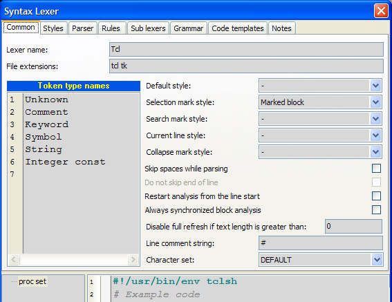

Button commands

*   Apply - Applies changes without dialog closing.
*   OK - Applies changes.
*   Cancel - Cancels changes.

Preview text

At the bottom of the dialog editor the sample code is placed. Any change of lexer configuration effects on the sample code. This preview text is also used in the "Customize lexer styles" dialog that is intended to change only styles.

Common page

*   Lexer name - name of the lexer. Usually it is a name of file format/language.
*   File extensions - list of file extensions to autodetect lexer.
*   Token type names - are associated with the integer value (line number). They are used to simplify token type assignment to the token rules and selecting a set of token types for conditions of block rules. Token type is integer value in the range 0..31.
*   Default style - default style which first is applied to the editor canvas. If default style is not specified, default font and color properties are used.
*   Selection mark style - style for selected block in the syntax memo. If no style is selected to draw selection in the editor default foreground and background are used.
*   Search mark style - style to mark out search results in the syntax memo. If no style is selected to draw search results in the editor default foreground and background are used.
*   Current line style - style that is used to draw current line (line with the caret). If you don't want highlight current line select style type "Only Background" and color of background "None".
*   Skip spaces while parsing - checkbox specifies how to process space characters (space, tab, CR, LF, FF). If it is checked all space characters will be skipped before token rules checking, otherwise they will not be skipped.
*   Do not skip end of line - specifies whether line breaks should be parsed.
*   Restart analysis from line start - if it is ON, parser results are cleared starting from start of line where text was changed, otherwise they are cleared after position of text changing.
*   Always synchronized block analysis - specifies whether block analysis should be always performed with text parsing, otherwise analyzer tries to perform block analysis after whole text was parsed.
*   Disable full refresh if text size is greater - specifies threshold after which full refresh (when text is changed) of sytactical obects will not be performed. If this value is 0 (by default), full refreshing is disabled. Full refreshing takes more time, but sometimes it may be useful for some parser's rules (for example, parser expression ".\*" will not work correctly without full refresh).

  

Common properties

  

All styles and rules are items derived from the same base class, so working with list is common for them.

Each item in list have unique name and index. Edit box under list allows to change name of the item. You can use drag&drop operations to change order of items. You can disable any item. Disabled items displayed with gray color. Disabled items will not be used in syntax analysis algorithm (rules) or will not be applied to the editor canvas (styles).

Commands:

*   Move item down.
*   Move item up.
*   Create new item.
*   Import items from other lexers.
*   Disable/enable item.
*   Delete item.
*   Delete all items.

Parent restrictions for rules

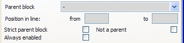

  

All rule classes are derived from same base class. In this class special conditions for rule enabling are defined. You can enable rule only within (out) some block.

Parent block - block rule of opened text range (when rule is being checked) that is verified for presence.

Strict parent block - flag that specifies that parent block must be immediate parent for the rule.

Not a parent - flag that specifies that "parent block" is not a parent of the rule.

  

Example:

implementation

const y: integer = 5;

function A;var x: integer;begin  case B of    0: begin      x := y;    end;  end; end;

start of "implementation" rangetoken detection for "const"start of "function" rangetoken detection for "var"start of "begin" rangestart of "case" rangestart of "begin" range (second)end of "begin" range (second)end of "case" rangeend of "begin" range, end of "function" range

For the detection "var" range "implementation" is a parent, but not a strint parent, range "function" is parent and strict parent.For "function" range detecting you can specify parent "implementation". If you set strict parent flag, nested functions will not be detected. Such restrictions will work only in units (where "implementation" section is present). Or you may specify that "function" range have not a "interface" parent (set flag "not a parent") in this case function will be detected not only in units but in programm file or in scripts.

Misc

Always enabled - flag that specifies that this rule will be active not only in the current lexer but in the nested lexers too. For example, in Pascal function we have "asm" range with reference to nested "Assembler" lexer. We can specify that "Comment" token rule is always enabled. In this case in the Assembler block Pascal comments will be highlighted correctly, otherwise this rule will be inaccessible in Assembler block.

  

Token rules (parser)

*   Overview
*   Properties of tokens
*   Expression examples

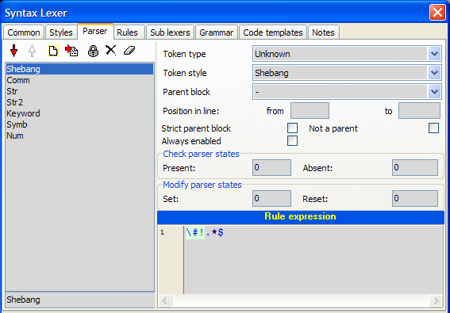

Overview

Token is an text element. Tokens have start and end position in text. Tokens can not intersect each other.

*   They are defined by the parsing procedure, after which token array is created. Token array is sequential, i.e. end position of token will be less start position of the next token.
*   Token rules are checked sequentially. After first successful checking of rule loop is stopped.
*   Token rules are intended for detecting tokens. You can control token rules in the page "Parser" of the lexer configuration dialog.

Properties of tokens

Token type - integer value that will be assigned to all tokens detected by means of this rule. It's required only if you want use this tokens in the block detection algorithm. To simplify token type assignment "Token type names" are used.

Token style \- style that will be applied to all tokens detected by means of this rule.

Rule expression - regular expression for detecting token. Regular expression is applied to current analysis position. If it matches, current position is incremented on the length of found token and token rules loop is stopped. Default modifiers for regular expression: (?imxr-s), i.e. ignore case, multiline (^, $ - start, end of line), supports comments, full russian charset, any metacharacter "." (dot) does not include end of line "\\n". Rule expression is most robust operation in lexer configuration. Below some examples are given.

Expression examples

Identifier

\[a-z\_\]\\w\*

First character is literal, others are word characters (including digits).

String

'.\*?('|$)

From the single quote to the next single quote or to the end of line. Multiplier is "non-greedy" to check next conditions ('|$) before incrementing position. ('|$) means either single quote or end of line.

Float const

#with exp. dot is optional \\d+ \\.? \\d+ e \[\\+\\-\]? \\d+ |#without exp. dot is required\\d+ \\. \\d+

\\d+ - means at least one digit. \\.? - means optional dot\[\\+\\-\]? - means optional "+" or "-".

Integer const

\\d+

Note: integer const must be listed after float const because of any float will be treated as integer until dot or exponent symbols.

Single line comment

//.\*

Any character from // to end of line. Metacharacter dot does not include end of line, so it is optional to place $ end of line metacharacter at the end of expression.

Multi-line comment

(?s)\\{.\*?(\\}|\\Z)

We turn on modifier "s" to include end of line in metacharacter "." (dot). It will select text from symbol "{" to the symbol "}" or to the end of text. If we skip end of text, i.e. (?s)\\{.\*?\\}, it will cause comment not detected.

Multi-line define

(?-i)\\#define(.\*\\\\\\s\*\\n)\* # lines with line folding .\* # last line

This is an example of complex expression for preprocessor directive "define". \\#define - means that token starts with #define (.\*\\\\\\s\*\\n)\* - means multiple any character until symbol "\\", then it skips spaces, includes end of line. All this expression can be repeated some times (or not once)..\* - means all characters until end of line.

  

Block rules

*   Block types
*   Text ranges
*   Highlight
*   Conditions

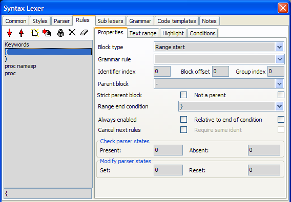

Block rules are applied to the array of tokens. Block rules are checked after each token detection. 

Block types 

specifies action after successful conditions check. 

There are four rule types:

1.  Tag detector - sets style of token (with Identifier index)
2.  Line separator - creates line separator
3.  Range start - creates text range
4.  Range end - closes text range.

  

Some properties of block rule use indexes. All indexes are back offset from the indexing reference point. 

There two case of reference point: 

1\. Start of conditions (index 0 corresponds to the first checked token). 2. End of conditions (index 0 corresponds to the last checked token). 

  

Rule "class derived" of Pascal lexer:0. EQUAL       <identifier>1. EQUAL      <symbol> 2. SKIP        <symbol, identifier>3. EQUAL     <symbol>4. EQUAL <identifier>5. EQUAL     <symbol>

   TComponent = class ( TPersistent , IInterface , IInterfaceComponentReference )Cond-start   9        8   7   6      5      4     3      2              1               0Cond-end     1        0  -1  -2     -3     -4    -5     -6             -7              -8

Due to there is SKIP condition in this rule, we do not know length of token sequence that satisfies this rule. To specify indexing reference point use . flag. When it is True indexing reference point - conditions end, otherwise indexing reference point - conditions start. In this example we must set this flag to True. 

\- back offset of identifier token. In example above identifier index may be 1 (token "TComponent") or -1 (token "class"). The default value of the Identifier Index is 0. It is not necessary to specify this property. 

\- back offset of text range start/end. It is used only for "Range start/end" rules. 

\- name of grammar rule which is used instead of conditions sequence to test current sequence of tokens. 

\- are common for all rules, see "Common properties". 

\- integer value that is used to filter text ranges by the syntax tree view. Default is 0, i.e. no filtering performed by the syntax tree. 

\- specifies token type which will be assigned to identifier token. This property available only for "Tag detector" rules. 

\- specifies position of the line separator (above or under token with Ident Index). This property available only for "Line separator" rules. 

\- reference to the block rule that will close text range, reference to the block rule, text range of which will be closed. This property available only for "Range start" rules. 

\- reference to the block rule text range of that will be closed by this rule. This property available only for "Range end" rules. 

\- When this flag is True, when closing text range condition checks identifiers of range start and range end. Only for "Range end" rules. 

\- specifies that block rules checking loop must be broken if this rule is successful. 

Text ranges

These properties are applied to created text ranges, i.e. they are used only for rule type "Range start". 

\- is used for formatting text range name that is used in TSyntaxTreeView. If it is empty, Identifier token will be taken as the range name. See Name formatting (for block rules) to understand principles of name formatting. 

\- is used for formatting text range group name that is used in TSyntaxTreeView. If it is empty, there is no group for this text range. If any text ranges within one parent have identical group name, Group node will be created with caption of this group name and all these text ranges will be children of this group node. See Name formatting (for block rules) to understand principles of building name format. 

\- is used for formatting string which is used to paint collapsed text icon (text displayed when text range is collapsed). When this property is empty collapsed text icon is not displayed (collapsed text range is shown as line separator). 

\- when this Flag is True, opened text range will be closed at end of text. Only for "Range start" rules. 

\- specifies whether rule should close previously opened text range before opening new text range. 

\- specifies whether text range should be closed immediately after opening. Text range will occupy tokens that was used when checking conditions or grammar rule. 

\- specifies whether text range must be displayed in TSyntaxTreeView control. Only for "Range start" rules. 

\- specifies whether text range can be collapsed by user. Only for "Range start" rules. 

\- specifies whether text ranges of this rule must be pined together by the staple. 

Highlight

\- For "Range start" rule specifies style of all token in the associated text ranges. For "Tag detect" rule specifies style of token with Ident Index. For "Line separator" rule specifies line color of separator. 

\- specifies highlighting region: 

Disabled 

No highlighting 

Only bounding tokens 

Only bounding tokens will be highlighted 

All tokens without bounds 

All tokens without bounds will be highlighted 

All range 

All tokens in text range will be highlighted 

\- when this flag is True, all lines of text range will be highlighted (will have the same foregound and background colors) with the specified Style. If style have ftBackGround type only backgound will be highlighted. Only for "Range start" rules. 

\- available only if "Highlight lines of block" is True. It specifies style of the selection in Syntax Memo. If it is True, inverted style colors will be used to paint selection, else default selection style will be used. Only for "Range start" rules. 

Active highlighting specify that text range may be highlighted only when caret is placed in some predefined position. Only for "Range start" rules. 

\- specifies caret position in text range: 

Any position (always) 

range will be always highlighted independently of caret position 

Bounds of the range 

range will be highlighted only when caret at the bounds of the range (two caret position) (for example, highlighting brackets) 

Bounding tokens 

range will be highlighted only when caret at the bounding tokens 

In the range 

range will be highlighted only when caret is anywhere within text range 

Begin of bounding tokens 

Text range is highlighted when caret is at the first charecter of the bounding tokens 

\- specifies that only nearest text range of this rule must be selected for active highlighting. For example, when we highlight "begin ... end" block, we want to highlight only nearest block. 

Here you may specifier styles and image indexes for the tree node associated with text range and group tree node created for this text range. 

Conditions

Conditions specify current position validation for this rule. If validating is successful corresponded action defined by the block rule type will be performed. There are any number of condition entries. Each condition have next attributes: 

\- may be one of the following: 

Equal 

Token must have token type to be in defined types and token sting must be in key list 

Not equal 

Token must not have token type to be in defined types and token sting must not be in key list 

Mask 

Token must have token type to be in defined types and token sting must be in key list (with mask) 

Skip 

Skips all tokens that have specified token type until next condition will be successful 

If key list is empty second part of condition is omitted. 

\- is a set of token types to check condition. 

\- is an array of strings to check condition. 

\- specifies whether it compares strings without case sensitive. 

Name formatting (for block rules)

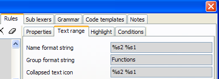

  

Name format string is used for formatting Name, Group name and Collapsed text icon of the text range.

In format string all entries of kind: %sINT, %eINT, %psINT, %peINT will be replaced with the token, index of which will be calculated on the assumption of the format expression.

Letters specify the reference index.

*   %s - start of current text range
*   %e - end of current text range
*   %ps - start of parent text range
*   %pe - end of parent text range

There may be several entries of "p" metacharacter. For example, %pps - means start of parent of parent text range.

Also after these specifiers you may use "L" or "Z":

*   L - defines string from line start to the token (including this token)
*   Z - defines string from the token to the end of line (including this token)

For example: %SL2 - defines string from line start to second token from text range start.

Token index will be calculated as reference index minus Index (INT).

Extension of name formatting syntax 

Syntax %(S|E)P\*(L|Z)?\[0-9\]+

is expanded to %(S|E)P\*(\[\\\[\]<token>\[\\\]\]<offset>?)?

where <token> is a specific token that is "searched from the specified starting point (S for first token in the range , or E for the last token) towards the respective range end (up- or downwards). The search-direction is kept in the variable "rngdir" which is set in the "S" , "E" decision. 

Example:

".... for x = 1 to 12 do ...... end ; ..."       0   1 2 3 4  5  6  ...    27  28

range-start = "for", range-end = "end" then "...%s\[to\] ..." will skip forward to the token "to" (with index 4). The token values are searched on a "asis" basis, there is no case-insensitivity option yet. A "numeric number following the token value will define an <offset> relative to the found token. For this clause, the variable "idx" is not set by taking the static numeric value as in "...%s2 ..." , instead the "found token index" is kept. 

For "%S..." the search starts at idx=0 up to max 28. ---> rngdir = +1; For "%E..." the search starts at idx=28 downto min 0. ---> rngdir = -1; 

Note: Avoid to search for tokens that can occur at multiple places (for example a ";" between statements). 

The above syntax is simple as it allows to identify the block-start-tokens "for x = 1 to 12 do"block-body anything after block-start tokens up toblock-end-tokens "end ;" 

but many syntax formats do not trivially support this separation. 

Any such clause (either absolute or given by token value) can "start a token range" by additionally specifying: 

%(S|E)...~(S|E)P\*\[0-9\]+

or

%(S|E)...~(S|E)P\*(\[\\\[\]<token>\[\\\]\]<offset>?)?

or

%(S|E)...~\[\\\[\]<token>\[\\\]\]

The first form uses the static index specification to define the end-range: "%s0~s3" results in "for x = 1" (tokens 0, 1, ... 3) 

The 2nd form uses the new syntax to "search for an end-token beginning at the starting range index (idx) up- or down-wards. "%s0~s\[do\]" results in "for x = 1 to 12 do" (tokens 0, 1, ... 6) if a search is not satisfied, the complete range up to "e0" is taken. Because of the same "S", the search starts with "TagStr\[idx\]" ... 

"s0~e\[do\]" results in the same string, but starts at the final "end" of the block and scanning downwards. Caution: This may produce WRONG results if nested loops are scanned ! I could not find a valid representation of "range-start" token-streams, the range-body alone and/or the range-end token-stream.Such information may be helpful to better display blocks and/or collapse display of the "block-body" alone. 

The 3rd form is an abbreviation where the S/E indicators are taken to be identical as the starting point S1~\[do\]1" results in "x = 1 to 12" (tokens 1, 2, ... 5) 

The <offset> "1" will here skip back by 1 from the found token "do". The range-end is kept in the variable "to\_idx". 

The "token-value" to search for can not be whitespace #00..#20. Leading and trailing whitespace withing the "...\[vvvvvvv\] ..." enclosed by \[ and \] characters sequence is removed before searching. the "vvvvvv" can contain escaped characters like "... \[\\\]\] ..." to allow "\[" and/or "\]" to be part of the value. The \\r, \\n, \\f ...escapes are not supported here. 

The token accumulation simply (?) takes all tokens from "idx" ... "to\_idx" and builds a string by appending all tokens with ONE " " (blank) as separating delimiter. There is no process to keep the original token positions within the source line(s) and any whitepace including cr/lf's there. This may be an addition but I currently do not see a need for it. 

c) "ranges as specified above may accumulate many tokens and it may be desirable to "limit" the result string. This can be done by using another operand syntax 

%(S|E)...~\[0-9\]+

or

%(S|E)...~(S|E)(\[\\\[\]<token>\[\\\]\]<offset>?)?~\[0-9\]+

or

%(S|E)...~\[\\\[\]<token>\[\\\]\]~\[0-9\]+

In all three forms the "~" is immediately followed by a numeric value which is interpreted as "maximum number of tokens in the substituted string", if the range takes MORE than this maximum The value is internally kept in the variable "rngmax" below. When the result string is accumulated (taking all tokens between "idx" up- resp. down-to "to\_idx") the number of appended tokens can not go beyond "rngmax". If this happens the result will be created in the form "t-1 t-2 -- t-max ..." with the ellipsis string " ..." appended.

Example:

function TMyClass.MyFunction ...

we have rule:0| .1| \[any Identifier\]2| function

reference start of text range will point to ".", soformat string"%s2 => %s1.%s-1"results"function => TMyClass.MyFunction"

Sub lexers

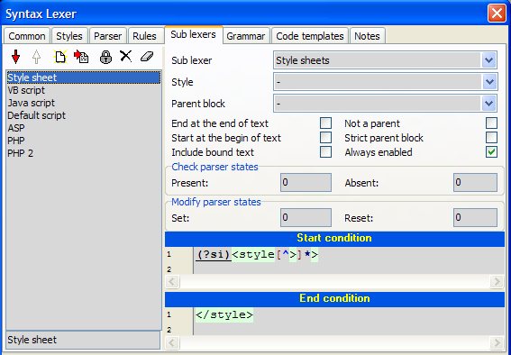

Nested lexers allow to use external lexer for the defined text ranges. For example, in HTML we want that scripts indide "" will be processed with the corresponded lexer (JavaScript, VBScript, etc). Sublexer rules are intended for this purpose.

To detect text ranges two regular expression are used: "Start condition" and "End condition". Text range will exist from the end of the "Start condition" to the start of the "End condition".

For example, we can use Assembler lexer inside Pascal:

*   Sub lexer = "Assembler"
*   Start condition = "asm"
*   End condition = "end"

In this case text range will be from the next character after "asm" to the previous character before "end".If text range must start from the begin of text, set property "Start at the begin of text".If text range must be closed at end of text, set property "End at the end of text".

Lexer inheritance

If you want to extend some lexer without modifying it, you can do this:

1.  Create new lexer.
2.  Create "Sublexer" rule for the base lexer from start to end of text.
3.  Create new rules and mark them as "Always enabled".

So you create inherited lexer which have all rules of the base lexer plus rules defined in the derived lexer.

  

Grammar

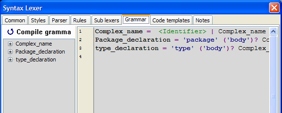

Grammar rules allow testing for complex sequences of tokens.Grammar rules are separated by semicolons.

Syntax of grammar definitions:

Rule ::= RuleName '=' Branch\_list ';'Branch\_list ::= Item\_list    | Branch\_list '|' Item\_listItem\_list ::= Element     | Item\_list Element Element ::= Item     | Item '\*'     | Item '+'     | Item '?' Item ::= RuleName     | '"' Term '"'    | ''' Term '''    | '<' TokenType '>'    | '(' Item\_list ')'

where:

*   "Term" - case insensitive string
*   'Term' - case sensitive string
*   TokenType - name of token type
*   RuleName - name of grammar rule

Repeaters:

*   '\*' - any number of entries including none
*   '+' - at least one entry
*   '?' - one entry or none

There are special grammar rule "Skip". It is used after each match operation to skip unused tokens (for example, comments).

  

  

Indentation-based folding

  

CudaText supports folding based on indentation levels of lines. Example lexer is Python, see how it's configured. The following tweaks must be applied to lexer in order to support indent-based folding:

*   Create only opening range rules, without closing rules. For these opening rules:

1.  Set "Close block at text end" flag.
2.  Set “Group index” = 20.

*   For parsers (rules with RegEx) which find token at range start (e.g. “def”, “class”, “if”, “while”... in Python) set “token types” names starting with “^” char. Those parsers can find tokens at any position, e.g. you can add parser with “token type”==“^id” which finds all words.
*   If you need to close blocks by “strings”, “comments”, “numbers” etc, then also set “token types” starting with “^” for all these parsers.

  

Currently lexer engine counts tab-char as 4 spaces, when calculating indent levels. This is default indentation for Python.

  

Compatability

This info is valid only for lexer engine in CudaText v1.105.1 or newer. CudaText older versions used another tweaks for indent-based folding.

SynWrite v6.41 or newer supports this too.

SynWrite v6.40.2770 doesn’t support these tweaks, so you won’t see working indent-based folding in SynWrite. You will see that all blocks are lasting until end-of-file.

  

  

Tutorial:

Creating the “WSH script” lexer

  

  

Intro

Tab “Common”

Tab “Styles”

Tab “Parser”

Tab “Rules”

Tab “Sub lexers”

  

Intro

  

This tutorial will guide you through the creation of lexer for SynWrite - the “WSH script” lexer. WSH stands for Windows Script Host. It’s ok example of simple lexer without a tree (it means that lexer hasn’t support for “Tree Structure” panel of SynWrite).

  

Open “Options -- Customize lexer library” dialog in SynWrite and create a new lexer by pressing the “New lexer” button. This will show “Lexer properties” dialog.

  

In the “Common” tab, enter some properties:

*   “Lexer name”: “WSH script” (without quotes).
*   “File extensions”: “wsf” (extension list is space-separated, w/o quotes).
*   check the “Skip spaces while parsing” checkbox. This will cause the parser to ignore spaces in the code. This option should only be left unchecked when creating lexers for space-dependent languages such as Python.
*   add some example WSH script in the editor at the dialog bottom.

  

  

  

Preview of sample WSH script:

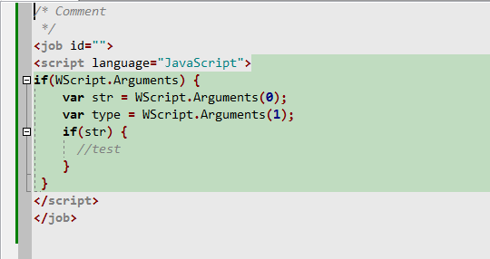

  

Press “OK” to save lexer in library. Close “Lexer library” dialog (confirm to save). Now to call lexer props dialog again:

*   activate the lexer (click in statusbar field, to show lexers menu)
*   call command “Options -- Customize lexer”

  

Now configure all other tabs of lexer props dialog.

  

  

  

Tab “Common”

  

Enter here “Token type names” list:

  

Unknown

Comment

Identifier

Symbol

String

Integer

  

Meaning of this list:

Each token type (Unknown, Comment, etc) can have its own RegEx (in “Parser” tab). After token types have RegEx attached, each token type can be referred to in “Rules” tab.

  

E.g. “Rules” tab can have a rule, which finds

*   token type “Identifier” with value “procedure”, then
*   token type “Identifier” with any value, then
*   token type “Symbol” with value “;”

and considers these 3 items as block beginning.

Then another rule can be added, which considers some N items as block ending. And then lexer can show entire block (from beginning to ending) in syntax tree, and/or allow folding for this block.

  

In WSH lexer we don’t use “Rules” tab.

  

  

Tab “Styles”

  

This tab holds all styles of lexer. Some styles are binded to token type names (from tab “Common”), some are for misc purposes, e.g. highlighting of nested lexers regions or brackets BG.

  

Some styles can be special - ie, assigned to lexer properties in “Common” tab:

*   Default style - used for not parsed text (text which isn’t caught by any parser)

*   Selection mark style - used to override selected block colors (option in SynWrite)
*   Search mark style - used to override “search marks” colors (placed by command “Find all/ mark” in Find dialog) (option in SynWrite)
*   Current line style - used for line with caret (option in SynWrite)
*   Collapse mark style - used to override “collapse marks” colors (collapsed folding blocks which look like “\[...\]”) (option in SynWrite)

  

It’s not recommended to use these special styles, better leave all styles on “Common” tab unassigned. And you may delete the style which maps to “Selection mark style” (it’s created by default for new lexer but isn’t needed).

  

Notes:

*   To rename a style, use the edit field below the styles listbox.

*   To disable/enable a style, use “Lock” button on “Styles” tab.
*   If option “Multiline border” is on and “Borders” lines are set, then multiline text region will show only “outer” border lines (but not inner lines inside the region).
*   It’s not recommended to use options “Hidden” and “Read only”, it may confuse user if he can’t see or edit some region.

  

  

Tab “Parser”

  

In this tab we must create parsers, which can parse text to predefined token types (token types are on “Common” tab). Created parsers:

  

*   “Comment” - token type “Comment” - to catch multiline comments /\*......\*/. Regex is with (?s) option to catch multiline text -

(?s)/\\\* .\*? \\\*/

  

*   “Comment 2” - token type “Comment” too - to catch single-line comments starting from chars ‘ or //. Regex -

'.\* | //.\*

  

*   “Comment 3” - token type “Comment” too - to catch HTML comments (WSH needs it): <!--........-->. Regex is with (?s) again -

(?s)<!-- .\*? →

  

*   “Symbol” - token type “Symbol” - to catch special chars (brackets, commas, equals etc). Regex -

\[;:=<>\\./\\?\\(\\)\\\[\\\]\]

  

*   “String” - token type “String” - to catch double-quotes strings. Regex (note that unclosed string will highlight to the line end) -

".\*?("|$)

  

*   “Tag” - token type “Tag” - WSH is tag based so it’s good to highlight tags in special color. Parser has regex which can catch both “<tag” and “</tag” (opening and closing tags). Regex uses “lookahead assertions”, see about it in SynWrite help topic about RegEx.

(?<=<) \\w+ |

(?<=</) \\w+

  

*   “Id” - token type “Identifier” - to catch all id’s not catched by previous parsers. Regex is usual, any name starting from letter or “\_” -

\[a-z\_\]\\w\*

  

Note:

You can import some of these parsers from other lexers. (This doesn’t mean importing of lexers! This means importing only of lexer parts, using the “Import items” toolbar button on “Parsers” tab.) Press “Import items” toolbar button and select some items e.g. from C lexer. After importing correct the parsers’ “token type” and “token style” (because C lexer has different token types).

  

Note:

you can add “Number” parser too, for token type “Integer”. Just create new style for numbers, and use regex “\\d+”. But WSH doesn’t need it, only embedded JS parts need it (and this is catched by JS sub lexer, no need in new parser).

  

  

  

Tab “Rules”

  

We don’t use it.

Tab “Sub lexers”

  

This tab will hold items for highlighting JavaScript and VBScript embedded scripts. Lexer library must contain these 2 lexers (otherwise feature won’t work).

  

For item “JavaScript” specify JS lexer name and such props:

*   start condition:

(?i)

*   (optional) style: some style which holds BG color only. This allows to highlight JS parts in different BG color.

  

These values must give correct highlighting of embedded JS code in example script. Ie, keywords “if”/”var” must be bold, and folding for “if” blocks must appear.

  

Note that regex contains “\\s” for space, needed as spaces are ignored in regex fields. Note that “(?i)” regex modifier is used, to make regex case-insensitive.

  

For item “VBScript” similar props must be set (see result lexer).

  

  

  

  

  

  

  

Tutorial:

Lexer rules

  

Intro

Make keywords bold

Basic folding rules

Rules for tree nodes

Rules for If without EndIf

Highlight brackets BG

Highlight multiline comments BG

All options of “Text range”

Name format string

Group format string

Collapsed text icon

Close block at end of text

Self closing range

Initially closed (no end rule)

Ignore as parent

Display in syntax tree

Can not be collapsed

Draw block staple

Auto closing text

Options “Parent block”, “Not a parent”

  

Intro

  

Lexer basics are shown already in the previous tutorial (about “WSH script” lexer). This tutorial will show how to configure “Rules” tab of SynWrite lexer props dialog, for “AutoIt” lexer (it’s already included in SynWrite).

  

You’ll see how to complete the following lexer tasks:

1.  make keywords bold
2.  create folding for blocks “If..EndIf”, “Select..EndSelect” etc
3.  create folding and tree nodes for “Func..EndFunc”
4.  handle special case “If without EndIf”
5.  create folding and BG highlighting for brackets ( ) \[ \]
6.  create folding and BG highlighting for multiline comments

  

Editor look:

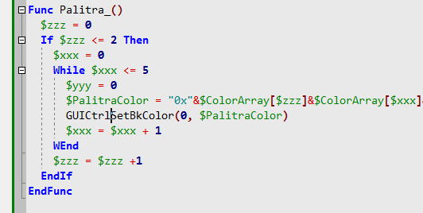

  

  

  

Make keywords bold

  

In “Rules” tab create a new rule “Reserved words”, then

1.  subtab “Properties”: set “Block type” to “Tag detector”.
2.  subtab “Conditions”: add single condition (button “+” near listbox), set its token type to “Id”, and paste full list of keywords (which are correct identifiers) into “Keys list” editor on the right. Don’t forget to check “Ignore case” flag.
3.  subtab “Highlight”: bind to this rule some style (this style should have “bold font” attribute and/or special font color, assigned as usual on “Styles” tab).

  

  

  

  

Basic folding rules

  

How to create folding rules for blocks “If..EndIf”, “Select..EndSelect”, “Switch..EndSwitch” etc. Example is for “Select..EndSelect”, others are similar. Open tab “Rules”, subtab “Properties”.

  

1.  Create beginning rule, rename it to e.g. “\_Select” (edit field is below the rules listbox), set its “Block type” to “Range start”.
2.  Create ending rule, rename it to e.g. “\_EndSelect”, set its “Block type” to “Range end”.
3.  Link both rules: set for rule “\_Select” “Range end condition” = “\_EndSelect”, and optionally set for rule “\_EndSelect” “Range start condition” = “\_Select”.
4.  For beginning rule open subtab “Conditions”, create a single condition (button “+” near listbox), and setup it so that it catches token type “Id” with value “Select”. (Set token type in the checker-listbox below the conditions listbox; and set value in the editor labeled “Keys list”). Don’t forget to set field “Condition” = “Equal”.
5.  For ending rule open subtab “Conditions”, create a condition, and setup it so it catches token type “Id” with value “EndSelect”.

  

You have created and linked two rules: beginning and ending. Now it’s needed to set up this pair a little: click beginning rule name, click subtab “Text range”, uncheck “Display in syntax tree”, and check “Draw block staple”. Other flags leave unchecked, not needed for simple lexer.

  

You see that in the result AutoIt lexer many rules are configured this way.

  

  

Rules for tree nodes

  

Create the similar rule pair \_Func/\_EndFunc (with token type “Id” and values “Func” and “EndFunc”). This pair needs to be in syntax tree, so click beginning rule \_Func, click subtab “Text range”, and check flag “Display in syntax tree”.

  

Now need to setup tree nodes: we need to see e.g. “Func MyName”, not some random word. Click subtab “Text range”, edit field “Name format string” to value “%s0 %s-1”. This means that tree item will show tokens \[0\] and \[-1\]. It’s hard to say which token numbers to use, it depends on some stuff, just tested that 0 and -1 are ok numbers (0 is the token at rule start and -1 is next one).

  

  

Rules for If without EndIf

  

Create the similar rule pair \_If/\_EndIf (with token values “If” and “EndIf”). Don’t check “Display in syntax tree” of course. Now we need to solve AutoIt issue:

1.  multi-line “If..Then..EndIf” must be folded
2.  one-liner “If..Then” doesn’t need ending “EndIf” and must not break folding

  

This is shown on image:

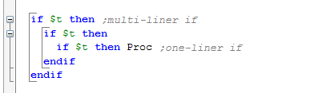

Outer Ifs are multi-line and have EndIf, and inner If is one-liner, it doesn’t have EndIf. This image shows final OK editor, with a trick applied. If you don’t make a trick, the inner If will catch outer EndIf and break the folding. How to setup the trick?

  

1) Create new token type “OneLinerThen” (on tab “Common”) and create new parser for it (on tab “Parsers”):

1.  “Token type” = “OneLinerThen”
2.  “Token style” = same style as for keywords
3.  Tricky regex, which catches word “then” only if it’s followed by spaces and some word (see “Lookbehind assertions” in SynWrite help about RegEx):

(?i)then\\b(?=\\x20+\\w)

1.  Move this new parser above “Id” parser.

  

2) For rule “\_If” clear “Range end condition” as we now want to have 2 ending rules for If: one already created “\_EndIf” and new one “\_EndIf\_OneLiner”, with the same “Range start condition” = “\_If”.

  

3) For new ending rule “\_EndIf\_OneLiner” in subtab “Conditions” create single condition: token type “OneLinerThen” and no token value (empty “Keys list”).

  

  

Highlight brackets BG

  

This step is optional, as SynWrite can highlight brackets BG by option “Highlight pair brackets”. But e.g. for Pascal lexer we may use this step to highlight pair tokens “begin”/”end”.

  

Create rules pair: opening rule “(“ and closing “)” and link this pair as with \_If/\_EndIf. For rule “(“ click subtab “Conditions” and add condition with token type “Symbol” and token value “(“. For rule “)” add condition with token type “Symbol” too and token value “)”.

  

Set up opening rule:

1.  subtab “Text range”: uncheck all flags. No need to show this block in tree nor no need to fold.
2.  subtab “Highlight”: assign style to this rule. This style better have BG color only (“Style type” = “Only background” in style options).
3.  subtab “Highlight”: set “Highlight type” = “Only bounding tokens” so only brackets will be highlighted, not entire brackets block.
4.  subtab “Highlight”: set “Caret position” = “Bounds of the range” so brackets will be highlighted only when caret is on one of them.

  

Create rules for brackets \[ \] the same way.

  

  

Highlight multiline comments BG

  

AutoIt has multi-line comments from “#comments-start” or “#cs” to “#comments-end” or “#ce” keywords. These comments can be inserted one into another. It’s hard and not nice to highlight such comments by Parser, e.g. by gray color - commented block will be all gray. Better we can - highlight only BG of such comments and leave usual text color of commented range. Example:

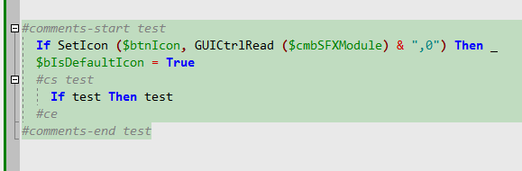

  

Create rules pair “\_cs” and “\_ce” similarly to brackets rules above.

For rule “\_cs” in subtab “Conditions” add single condition:

1.  don’t set its token type (all checkboxes unchecked)
2.  set field “Condition” to “Mask” (ie, regex)
3.  set “Keys list” to two strings (we escape # char with a backslash):

\\#comments-start

\\#cs

The same way set up rule “\_ce” with two strings:

\\#ce

\\#comments-end

  

Now set up rule “\_cs” on subtab “Highlight”:

1.  set “Style” to some style, which has BG color only (to not override text color of commented range).
2.  set “Highlight type” = “All range”.
3.  set “Caret position” = “Any position (always)”.

  

Note that condition setup was a little tricky: we couldn’t set some “token type” for condition because we haven’t parser for text “#comments-start” (ready parser “Comment” is not fully ok).

  

  

  

  

All options of “Text range”

  

Name format string

  

For tree nodes only. Documented in file “Readme\\LexerConfig.chm”. Contains text and token specifiers. E.g. you may:

1.  show token \[0\]: “%s0”

1.  show tokens range \[0..-3\]: “%s0~s-3”
2.  show tokens from \[0\] to line end: “%sz0”
3.  show tokens from line start to \[2\]: “%sl2”
4.  show tokens from \[0\] to \[end of rule\] minus 2 tokens: “%s0~e2”
5.  show tokens from \[0\] to token value “>” minus 1 token: “%s0~s\[>\]1”
6.  show token from parent range: “%ps0”

  

Group format string

  

Uses same format as “Name format string”.

Needed not empty if we want to put tree nodes into some group, e.g. you may enter “\\Functions” and see all funcs inside “Functions” root node, or e.g. enter “Classes” to group classes nodes.

  

Collapsed text icon

  

Uses same format as “Name format string”.

Used to show text for collapsed folding block. Better set to same value as “Name format string”.

  

Close block at end of text

  

Sometimes file may not contain text to match the ending rule (but it still may contain it in some cases). Check this flag to force close opened block at end of file.

  

Self closing range

  

Sometimes block beginning also means ending of the previous block of the same type. E.g. in “Markdown” lexer: any “paragraph header” means closing of the previous paragraph. So this flag is needed. Usually used with “Close block at end of text”.

  

Initially closed (no end rule)

  

Means that beginning rule doesn’t have any ending rule. Such “empty” block cannot be folded of course, but still can be shown in the tree. Needed when it’s hard to create ok ending rule.

  

Ignore as parent

  

Means that option “Parent block” from subtab “Properties” won’t consider this block as possible parent. Very rarely needed.

  

Display in syntax tree

  

Enables to show tree node for this rule.

  

Can not be collapsed

  

Disables folding for this block.

  

Draw block staple

  

Enables so called “indentation guides” for this block. Ie, optionally-styled vertical lines which are drawn from block beginning to end.

  

Auto closing text

  

Can enable auto-entering of some text, when beginning text (for beginning rule) is entered and Enter is pressed. E.g., in C lexer this option can enable auto-entering of “}” on a new line, when “{“ typed and Enter pressed. Text must be in the edit field below the flag.

  

  

  

Options "Parent block", "Strict parent", "Not a parent"

  

Parent rule is the rule of parent-node of current node in syntax-tree.

Example. Current rule is A, it's "parent block" cleared or set to P.

  

*   If "Parent block" cleared, no checking of parents made.
*   If "Not a parent" set, then parent of A can be any rule \*except\* rule P.
*   If "Strict parent" set, then parent of A must be P, and P must be \*nearest\* parent, not parent of parent (of parent...) of A.
*   Not sure what means "strict parent" and "not a parent" both set.

  

  

Tutorial:

Lexer rules 2

  

This doc shows how to configure syntax-tree support («Syntax tree» panel in SynWrite) for lexers. See ready lexer: Julia, install it via «Addons manager» in SynWrite.

Example of Julia source text

function Base.sort!(v::AbstractVector, lo::Int, hi::Int)

while true

clean \= true

for i \= 0 #skipp

if Sort.lt(o, v\[i+1\], v\[i\])

clean \= false

end

end

clean && break

end

return v

end

macro enum(T,syms...)

blk \= quote

immutable $(esc(T))

n::Int32

$(esc(T))(n::Integer) \= new(n)

end

end

end

  

You see that blocks are

1) from «if/for/while/quote» to «end» - not needed in tree,

2) from «function/macro» to «end» - needed in tree with name of function.

  

Open «Lexer properties» dialog, goto «Rules» tab, here needed all items for blocks. You see such rules:

Rule «keyword»

\- to hilite keywords in bold.

*   «Properties» tab: for rule set «Block type» to «Tag detector».
*   «Highlight» tab: set style «Id keyword» to hilite in bold (this style can be any with bold).
*   «Conditions» tab: just paste word list into right editor, and set type «Id», and condition «Equal».

  

Rule «block end»

\- to mark end of blocks by «end» keyword. «Properties» tab: set «Block type» to «Range end». «Conditions» tab: add some conditions: you see 2 conditions here:

*   0) type «Id», value «end», condition «Equal». Condition makes rule active for keyword.
*   1) type «Symbol», value «\[», condition «Not equal». Condition is a tweak to disable rule, if token before «end» is bracket. It“s needed to not take «n = name\[end\]» (happens in lang).

Now need to set starting rules for this end-rule: one block for tree, other block not for tree.

  

Rule «block»

\- for blocks not in tree.

*   «Properties» tab: set «Block type» to «Range start», set «Range end condition» to name of rule above «block end».
*   «Text range» tab: just set 2 flags: «Display in tree» off, «Draw block staple» on.
*   «Conditions» tab: add condition with «Equal», type «Id», paste into editor list of keywords: «if/for/while/...»

  

Rule «block tree»

\- for functions in tree.

*   «Properties» tab: same as before.
*   «Conditions» tab: same as before, list of keywords is «function/macro/...»
*   «Text range» tab: set 2 flags: «Display in tree» on, «Draw block staple» off.
*   «Text range» tab: we have rule for tree, so set
*   «Name format string» to e.g. «%sz0» - means that tree shows all from token0 to end if line. Or you can write e.g. «%s0 %s-1» to show in tree 2 tokens.
*   «Collapsed text icon» - optional, this shown when you fold block in app with \[-\] icon. Also can write e.g. «function %s-1».
*     
    
*     
    

How to fold blocks from «if» to «end if»

Sometimes needed to fold block with equal words: AppleScript needs:

*   if ... end if
*   for ... end for
*   repeat ... end repeat
*   on SomeName ... end SomeName

This can be done, you need flag «Require same ident», in «Properties» tab for end-rule. This makes pair by equal tokens from begin-rule/ end-rule. E.g.

*   token\[0\] in begin-rule, so set «Identifier index» to 0
*   equals to token\[1\] in end-rule, so set «Identifier index» to 1.

HTML lexer uses same method for pair <tag>...</tag>, it has "Require same ident" checked for end-rule.

For AppleScript needed also tweak, that «end if» text cannot start new block «if». This can be done. Just set flag «Cancel next rules» for end-rule. (Rule must be upper in rules list, to skip next rules.)

  

  

Tutorial: advanced lexer options

  

1) Parser states

  

Options in Lexer Properties dialog: parser state - present/absent/set/reset. These 4 options exist for “Parser” tab and for “Rules” tab, so states can be used for parsers, and for range rules.

Parser state is 32 bit number. It has bits:

*   bit0 – gives number 1
*   bit1 – gives number 2
*   bit2 - gives number 4
*   bit3 – gives number 8
*   bit N - gives number 2^N

To pack bits to number, add numbers: bit2 and bit3 – gives number 4+8 = 12.

Check state: Present: \- rule will run only if bits from number are set (in parser state). For ex, 12 means that check is: bit2 and bit3 are set. For ex, to check that bit0/bit1/bit2 are set, use number 7 (1+2+4).

Check state: Absent: - rule will run only if bits from number are cleared (in parser state). For ex, 12 means that check is: bit2 and bit3 cleared.

Modify state: Set: – when rule activates, it sets bits (in parser state) from this number. For ex, if you want to set bit3, set option to 8.

Modify state: Reset: \- when rule activates, it clears bits (in parser state) from this number. For ex, if you want to clear bit3, set option to 8.

Real example in lexer LaTeX. It has block rules “math begin”, “math end”. Opening rule runs when bit2 is clear, then sets bit2. Closing rule runs when bit2 is set (by opening rule before) and then it clears bit2 (for next running of opening rule). Some parser rule can check bit2, and this parser rule runs only inside math-block. So lexer can hilite something only inside math-block. Rules “\[“, “\]” also set and reset bit0. So lexer hilites words inside “\[ \]” blocks, with another style.

  

  

2) Parent block

  

Options exist for tab “Parser” and tab “Rules”.

Option “Parent block” - use it, to run rule only when current position lies inside block NN (with opening rule NN to be correct). Maybe also inside some sub-block of this block NN, or block of 2-3-4... level inside NN.

Option “Strict parent block” - use it when you need position inside block NN, but not its nested blocks.

Option “Not a parent” \- use it when you need position in any blocks, except block NN. You can combine this opt with “Strict parent”.

Option “Always enabled” - if on, check will be ok also when this lexer is sublexer (of some outer lexer).

Option “Ignore as parent” (in “Text range” tab) – helper option for above opts, you can disable some rule for parent detections.

  

  

3) Same id in opening/closing rule

  

This is needed, when lexer uses folding from e.g. <tagname> to </tagname> (HTML) or e.g. from “begin Name” to “end Name”. Here you must check, that folding wont fold from <aa> to </ccc>, wont fold from “begin NameA” to “end NameB”. Good lexer must check this in folding. Used in HTML, XML, LaTeX, some others.

Opening block has disabled flag “Require same indent”, but closing block must have it checked. Now set, where is Id. Use option “Identifier index” - here is index of token with Id, in tokens list of “Conditions”. Seems that you should check flag “Relative to end of condition” too (not sure here), and write negative index – e.g. “-2” means that 3rd item from end of condition list is Id. Must do it for opening+closing rules.

  

4) Block offset

  

This option is needed to adjust block (in “Rules” tab) when block works, but result of block hiliting is shifted (to left or right). For ex, rule has N items in Conditions list, and found some range. You set a style “Some BG” for this rule, style hilites block shifted by 2 tokens to right. Use option “-2” to shift block lefter.

5) Regex in Conditions list

  

You can use regex for items in rules (tab “Rules”, sub-tab “Conditions”). Set choice “Condition” to “mask” or “strict mask” and write regex, where you usually write words, in listbox on the right. “Strict mask” means that regex match is entire token (else can be part of token).

  

6) Initially closed (no end rule)

  

This is option for rule in “Text range” tab. Needed for ranges, which you cannot find good. Some C-like lexer needs it: it is easy to find beginning of range (by keyword “func” for ex) but it’s hard to find ending of range (reason is nested “{}” or smth, always thriller for C-like). You set this option, and block still found, but without end, you cannot fold it, but can show it in the Tree panel.

Of course, such blocks cannot include another blocks, so “function inside function” will be 2 functions on the same level, in the Tree.

  

7) Advice for C-like lexers

  

Don't make single token type "Symbol" for all symbols (brackets, punctuations, operators), instead make it like updated Java lexer. Several "token types":

*   "Symbol ()" for round brackets
*   "Symbol {}" for curly brackets
*   "Symbol" for others
*   maybe 4th type "Symbol single". 3rd and 4th types are needed to support "font ligatures": one rule gets 1+ chars (regex has "+"), another gets single char (regex without "+").

Types "Symbol ()" and "Symbol {}" are very useful for C-like lexers: in opening rule for "function start" you can skip not all symbols now, but only "Symbol" symbols (so won't skip () and {} brackets). Conditions for rule will be like this:

*   token "id" with value “function”
*   skip tokens "comment"
*   token "id"
*   token "symbol ()" with value "("
*   skip tokens "id", "symbol", "string", "number", "comment"
*   token "symbol ()" with value ")"
*   skip tokens again
*   token "symbol {}" with value "{"

Ending rule can have single condition, for token “symbol {}” with value “}”. And ending rule can be used by several opening rules, of course (Java lexer does it).

  

  

How to configure lexers to render ligatures

  

Ligature is sequence of symbols, which is rendered special by some fonts. “Fira Code” is font on which they tested. To allow a lexer to render ligatures, you need to find list of ligatures for this lexer, e.g. JavaScript has only few (long equal, not equal, less or equal, greater or equal, start/end of comment, two ! chars, two pluses). Then you should change lexer parsers, make 2 parsers usually:

  

1) First parser “Single symbol” to find brackets (brackets are single, not parts or ligature). Regex should be “\[\\(\\)\\\[\\\]\\{\\}\]” to catch one.

  

2) Second parser “Symbol” for long symbols (len 1, 2 or bigger). Regex here is usually

“\[/\\+\\-\\\*:=<>&/\\|\\^\\$~!%\\#@\]+” with plus at end to catch many.

  

Both parsers have same “token type” and “token style” (or you can set special style to brackets, like Clojure lexer does).

Clojure has a special regex for brackets, to catch also “#\_(“ and “#(“ and “#{“ - for ligatures.